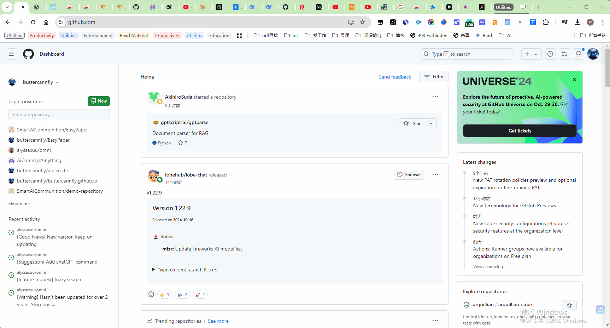

# 🤖 AIPex - AI驱动的浏览器自动化扩展

> **用自然语言命令自动化您的浏览器 - 开源浏览器自动化解决方案**

  <a href="README.md">🇺🇸 English</a> | <a href="README.zh-CN.md">🇨🇳 中文</a>

  **⭐ 如果这个项目对您有帮助，请给我们一个星标！⭐**
  
  

---

## 🤖 什么是AIPex？

AIPex是一个革命性的Chrome扩展，将您的浏览器转变为智能自动化平台。使用**自然语言命令**和**AI驱动的智能**，AIPex可以自动化几乎任何浏览器任务 - 从复杂的多步骤工作流到简单的重复操作。

### 🎯 为什么选择AIPex进行浏览器自动化？

- 🧠 **自然语言控制**: 用简单的英语命令控制您的浏览器 - 无需编程
- 🤖 **AI驱动智能**: 30+ MCP工具，理解上下文并适应您的需求
- ⚡ **多步骤自动化**: 用单个命令执行复杂的工作流
- 🔄 **通用兼容性**: 适用于任何网站 - 无需特殊设置
- 📊 **智能数据提取**: 自动收集和整理网页信息
- 🎯 **精确操作**: 使用AI视觉点击、填写、滚动和与元素交互
- 📝 **表单自动化**: 填写表单、提交数据和处理复杂交互
- 🖼️ **视觉理解**: AI可以查看和理解页面内容，实现智能自动化
- 🔧 **开发者友好**: 开源，具有广泛的自定义自动化API
- 🚀 **闪电般快速**: 在几秒钟内执行自动化任务，而不是几分钟

## ✨ 核心自动化功能

### 📊 智能数据提取
- **智能内容分析**: 从任何网页提取结构化数据
- **价格监控**: 跨多个电商网站跟踪价格
- **研究自动化**: 自动从多个来源收集信息

### 🎯 精确元素交互
- **视觉元素检测**: AI可以查看和与页面元素交互
- **表单自动化**: 通过智能字段映射填写复杂表单
- **动态内容处理**: 适应变化的页面布局和内容

### 📝 内容处理与分析
- **文本高亮和总结**: 自动高亮和总结重要内容
- **文档处理**: 从网络文档中提取和整理信息
- **智能笔记**: 从网页浏览中捕获和整理见解

### 🗂️ 高级标签页和窗口管理
- **AI驱动组织**: 按主题自动分组和整理标签页
- **智能标签页切换**: 使用自然语言查找和切换标签页
- **多窗口协调**: 跨多个浏览器窗口管理复杂工作流

## 🤖 浏览器自动化使用场景

AIPex擅长通过自然语言命令自动化复杂的浏览器任务。以下是一些强大的使用场景：

### 🔍 研究与信息收集
- **"请使用Google研究主题'MCP'"** - 自动搜索并收集任何主题的信息
- **"查找关于AI发展的最新新闻"** - 搜索最近的新闻和文章
- **"研究React开发的最佳实践"** - 从多个来源收集综合信息
- **"查找学习TypeScript的教程"** - 发现教育资源和技术指南

### 📊 数据收集与分析
- **"请帮我找到 https://github.com/AIPexStudio/aipex 的第一个星标"** - 从网页中提取特定信息
- **"从多个来源获取比特币当前价格"** - 从各种网站收集实时数据
- **"查找这个GitHub仓库的所有贡献者"** - 从GitHub页面提取和组织数据
- **"比较不同电商网站的笔记本电脑价格"** - 收集价格信息进行比较

### 📧 邮件与通信自动化
- **"起草一封安排下周会议的邮件"** - 使用AI辅助自动撰写邮件
- **"向我最后的联系人发送跟进邮件"** - 自动化邮件序列和跟进
- **"查找旧金山科技公司的联系信息"** - 研究和收集联系详情

### 🛒 电商与购物
- **"查找无线耳机的最佳优惠"** - 在多个购物网站搜索
- **"跟踪这个产品的价格变化"** - 监控价格波动
- **"查找这个商品的客户评价"** - 收集用户反馈和评分
- **"比较不同智能手机型号的规格"** - 提取和比较产品详情

### 📝 内容创建与管理
- **"总结这篇文章并保存到我的笔记中"** - 提取和总结网页内容
- **"查找与这篇文章相似的文章"** - 在网络上发现相关内容
- **"创建关于机器学习的阅读清单"** - 汇编特定主题的资源
- **"将此页面的所有图片保存到我的下载文件夹"** - 批量下载内容

### 🔧 开发与技术任务
- **"查找这个API的文档"** - 定位技术文档
- **"检查这个npm包是否仍在维护"** - 研究包的状态和维护情况
- **"查找这个编程概念的代码示例"** - 收集编程教程和示例
- **"监控这个仓库的GitHub问题"** - 跟踪项目更新和问题

### 📈 商业智能
- **"研究AI领域的竞争对手"** - 收集竞争情报
- **"查找可再生能源的市场趋势"** - 收集市场研究数据
- **"跟踪我们品牌的社交媒体提及"** - 监控在线品牌存在
- **"分析我们产品的客户评价"** - 收集和分析用户反馈

### 🎓 学习与教育
- **"创建学习Python的学习计划"** - 组织教育资源
- **"查找JavaScript的练习题目"** - 发现学习材料
- **"研究量子计算的最新发展"** - 了解前沿话题
- **"查找数据科学的在线课程"** - 发现教育机会

### 🏠 个人生产力
- **"查找我附近最好的餐厅"** - 发现本地企业
- **"研究我的假期的旅行选择"** - 规划旅行并寻找优惠
- **"跟踪我最喜欢的运动队的赛程"** - 获取体育信息和更新
- **"查找今晚晚餐的食谱"** - 发现烹饪灵感

## 🚀 快速开始

### 快速开始
1. **从Chrome网上应用店安装** (推荐)
   - [点击此处安装](https://chromewebstore.google.com/detail/aipex-%E2%80%94%E2%80%94-tab-history-mana/iglkpadagfelcpmiidndgjgafpdifnke?hl=zh-CN&utm_source=ext_sidebar)

2. **打开AIPex**
   - 按 `⌘+M` (Mac) 或 `Ctrl+M` (Windows/Linux)
   - 或点击工具栏中的AIPex图标

3. **开始自动化**
   - 输入 `/ai` 开始AI自动化聊天
   - 使用自然语言: "点击登录按钮", "填写这个表单"
   - 尝试复杂工作流: "研究React最佳实践并保存到笔记"

### 键盘快捷键
| 操作 | Mac | Windows/Linux |
|------|-----|---------------|
| 打开AIPex | `⌘+M` | `Ctrl+M` |
| 新标签页 | `⌘+T` | `Ctrl+T` |
| 固定标签页 | `⌥+⇧+P` | `Alt+Shift+P` |
| 静音标签页 | `⌥+⇧+M` | `Alt+Shift+M` |
| 全屏 | `⌘+Ctrl+F` | `Ctrl+F` |
| 重新加载 | `⌘+⇧+R` | `Ctrl+Shift+R` |

## 🛠️ 开发和贡献

我们欢迎贡献！以下是您可以帮助AIPex变得更好的方式：

📖 **有关详细的开发设置、构建说明和贡献指南，请参阅 [DEVELOPMENT.md](DEVELOPMENT.md)**

### 贡献者快速开始
- 🏗️ **本地开发**: 参见 [DEVELOPMENT.md#local-development-setup](DEVELOPMENT.md#local-development-setup)
- 🔧 **构建**: 参见 [DEVELOPMENT.md#building-for-production](DEVELOPMENT.md#building-for-production)
- 🤝 **贡献**: 参见 [DEVELOPMENT.md#how-to-contribute](DEVELOPMENT.md#how-to-contribute)
- 📊 **项目状态**: 参见 [DEVELOPMENT.md#development-status](DEVELOPMENT.md#development-status)

### 📊 工具类别概述

🗂️ <strong>标签页管理</strong> - 8个工具

完整的标签页控制和导航:
- `get_all_tabs` - 获取所有窗口中的所有打开标签页
- `get_current_tab` - 获取当前活动标签页的信息  
- `switch_to_tab` - 通过ID切换到特定标签页
- `create_new_tab` - 使用指定URL创建新标签页
- `get_tab_info` - 获取特定标签页的详细信息
- `duplicate_tab` - 复制现有标签页
- `close_tab` - 关闭特定标签页
- `get_current_tab_content` - 获取当前标签页的可见文本内容

📄 <strong>页面内容和交互</strong> - 15个工具

内容提取、分析和页面交互:
- `get_page_metadata` - 获取页面元数据，包括标题、描述、关键词
- `extract_page_text` - 提取文本内容，包括字数统计和阅读时间
- `get_page_links` - 获取当前页面的所有链接
- `search_page_text` - 在当前页面搜索文本
- `get_interactive_elements` - 获取所有交互元素（链接、按钮、输入框）
- `get_interactive_elements_optimized` - 针对复杂页面的优化版本
- `click_element` - 使用CSS选择器点击元素
- `summarize_page` - 总结页面内容和要点
- `fill_input` - 在输入框中填写文本
- `clear_input` - 清除输入框的内容
- `get_input_value` - 获取输入框的当前值
- `submit_form` - 使用CSS选择器提交表单
- `get_form_elements` - 获取所有表单元素和输入字段
- `scroll_to_element` - 滚动到DOM元素并居中
- `highlight_element` - 永久高亮DOM元素
- `highlight_text_inline` - 在文本中高亮特定单词或短语

⬇️ <strong>下载和文件</strong> - 4个工具

下载控制和文件管理:
- `download_text_as_markdown` - 将文本内容下载为markdown文件
- `download_image` - 从base64数据下载图像
- `download_chat_images` - 从聊天消息下载多个图像
- `download_current_chat_images` - 从当前AI聊天下载所有图像

📸 <strong>截图</strong> - 3个工具

视觉捕获和截图管理:
- `capture_screenshot` - 捕获当前可见标签页的截图
- `capture_tab_screenshot` - 通过ID捕获特定标签页的截图
- `capture_screenshot_to_clipboard` - 捕获截图并保存到剪贴板

🔧 <strong>高级功能</strong> - 3+个工具

高级浏览器自动化和实用工具:
- 用于增强浏览器控制的额外专业工具
- AI驱动的内容分析和处理
- 自定义自动化工作流

## 📄 许可证

本项目基于 MIT 许可证 - 查看 [LICENSE](LICENSE) 文件了解详情。

## 🙏 支持与社区

- 🐛 **发现错误？** [提交问题](https://github.com/buttercannfly/AIPex/issues)
- 💡 **有功能请求？** [开始讨论](https://github.com/buttercannfly/AIPex/discussions)
- 🤝 **想要贡献？** 查看我们的 [贡献指南](DEVELOPMENT.md#how-to-contribute)
- 💬 **需要帮助？** [加入我们的社区讨论](https://github.com/buttercannfly/AIPex/discussions)

## 🏆 贡献者

感谢所有帮助AIPex变得更好的优秀贡献者：

<table>
  <tr>
    <td align="center">
      <a href="https://github.com/buttercannfly">
        
         
        <b>ropzislaw</b>
      </a>
       
      56 commits
    </td>
    <td align="center">
      <a href="https://github.com/Codexiaoyi">
        
         
        <b>Codexiaoyi</b>
      </a>
       
      10 commits
    </td>
    <td align="center">
      <a href="https://github.com/buttercannfly">
        
         
        <b>buttercannfly</b>
      </a>
       
      5 commits
    </td>
  </tr>
</table>

**总贡献者: 3** | **总提交: 71**

---

*想要贡献？查看我们的 [贡献指南](DEVELOPMENT.md#how-to-contribute) 并帮助AIPex变得更好！*

## 🌟 星标历史

---

  <strong>Made with ❤️ by the AIPex Team</strong>
  
  
  

